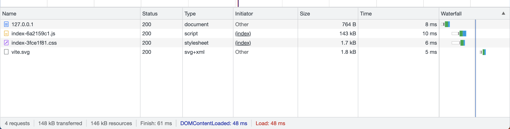

## building tools optimization setting

原因：减少文件体积，加快加载速度。

怎么做：
通过构建工具进行优化，主要包括：代码分割压缩、去除 CSS 无使用的代码、tree shaking、scope hoisting、动态 polyfill、缓存、多进程打包。

webpack 通过 `optimization` 字段进行配置，vite 通过 `build` 字段进行配置。

## 1. 代码分割压缩

### webpack

```js
// webpack.config.js

const { merge } = require('webpack-merge')
const commonConfig = require('./webpack.common.js')

module.exports = merge(commonConfig, {
  optimization: {
    splitChunks: {
      chunks: 'all',
      minSize: 30000,
      maxSize: 0,
      minChunks: 1,
      maxAsyncRequests: 5,
      maxInitialRequests: 3,
      automaticNameDelimiter: '~',
      automaticNameMaxLength: 30,
      name: true,
      cacheGroups: {
        vendors: {
          test: /[\\/]node_modules[\\/]/,
          priority: -10
        },
        default: {
          minChunks: 2,
          priority: -20,
          reuseExistingChunk: true
        }
      }
    },
    minimizer: [
      new TerserPlugin({
        terserOptions: {
          compress: {
            drop_console: true,
            drop_debugger: true
          }
        }
      })
    ]
  }
})

```

### vite

```js
// vite.config.js

export default {
  build: {
    rollupOptions: {
      output: {
        // 单独分割的资源分别判断
        manualChunks(id) {
          // css
          if (id.includes('style.css')) {
            return 'src/style.css'
          }
          
          // 单独分割组件
          if (id.includes('src/components')) {
            return id
              .toString()
              .split('src/components/')[1]
              .split('/')[0]
              .replace('@', '')
          }


          // 最小化的资源
          if (id.includes('node_modules')) {
            return id
              .toString()
              .split('node_modules/')[1]
              .split('/')[0]
              .replace('@', '')
          }
        }
      }
    }
  }
}
```

没有使用代码分割的情况：


使用代码分割的情况：


## 2. tree shaking

本质上是移除 JavaScript 上下文中的未引用代码。

依赖于 ES6 模块的静态结构特性，即 `import` 和 `export`。用来检测代码模块中的未引用代码，从而进行优化。

vite 默认开启 tree shaking。

### webpack

```js
// webpack.config.js

const { merge } = require('webpack-merge')
const commonConfig = require('./webpack.common.js')

module.exports = merge(commonConfig, {
  optimization: {
    usedExports: true
  }
})

```

## 3. scope hoisting 作用域提升

作用：将打包后的代码文件更小，运行时更快。

原理：通过分析模块之间的依赖关系，尽可能的把打散的模块合并到一个函数中，前提是不能造成冗余，因此只有被引用的模块才会被合并。

### webpack

```js
// webpack.config.js

const { merge } = require('webpack-merge')
const commonConfig = require('./webpack.common.js')
const webpack = require('webpack')

module.exports = merge(commonConfig, {
  plugins: [
    new webpack.optimize.ModuleConcatenationPlugin()
  ],
})

```

## 4. 动态 polyfill

将代码降级到更低的版本，使得更多的浏览器可以兼容。

### webpack

由于使用 @babel/parset-env 无法完全实现动态 polyfill，因此需要使用 @babel/plugin-transform-runtime。

```js
// webpack.config.js

const { merge } = require('webpack-merge')
const commonConfig = require('./webpack.common.js')

module.exports = merge(commonConfig, {
  module: {
    rules: [
      {
        test: /\.js$/,
        use: [
          {
            loader: 'babel-loader',
            options: {
              presets: [
                [
                  '@babel/preset-env',
                  {
                    useBuiltIns: 'usage',
                    corejs: 3
                  }
                ]
              ],
              plugins: [
                [
                  '@babel/plugin-transform-runtime',
                  {
                    corejs: 3
                  }
                ]
              ]
            }
          }
        ]
      }
    ]
  }
})
```

### vite

```bash
# install
npm i -D @vitejs/plugin-legacy@1.7.1
```

```js
// vite.config.js
import legacy from '@vitejs/plugin-legacy'

export default {
  plugins: [
    legacy({
      targets: ['defaults', 'not IE 11']
    })
  ]
}
```

加上动态 polyfill 后的打包文件：

## 5. 动态 import

### vite

使用 `import.meta.glob` 与 `import.meta.globEager`。

`import.meta.glob` 获取到的文件是懒加载的。会返回一个对象，对象的 key 是匹配到的文件路径，value 是一个函数，调用改函数会返回一个 Promise，Promise 的结果是一个对象，对象的 key 是匹配到的文件路径， value 是该文件的导出。
`import.meta.globEager` 不使用 then 方法，获取到文件全局上下文。获取到的文件是同步加载的。

```js
// global.js

const modules = import.meta.globEager('./modules/*.js')
const components = import.meta.glob('./components/*.vue')

// modules
for (const path in modules) {
  console.log(path, modules[path]())
}

// components
components['./components/HelloWorld.vue']().then(({ default: component }) => {
  console.log(component)
})
```

## 6. 缓存

### webpack

```js
// webpack.config.js

const { merge } = require('webpack-merge')
const commonConfig = require('./webpack.common.js')
const webpack = require('webpack')

module.exports = merge(commonConfig, {
  cache: {
    type: 'filesystem',
    buildDependencies: {
      config: [__filename]
    }
  }
})
```

## 7. 多进程打包

### webpack

```js
// webpack.config.js

const { merge } = require('webpack-merge')
const commonConfig = require('./webpack.common.js')
const HappyPack = require('happypack')
const os = require('os')
const happyThreadPool = HappyPack.ThreadPool({ size: os.cpus().length })

module.exports = merge(commonConfig, {
  module: {
    rules: [
      {
        test: /\.js$/,
        use: 'happypack/loader?id=happyBabel',
        exclude: /node_modules/
      }
    ]
  },
  plugins: [
    new HappyPack({
      id: 'happyBabel',
      loaders: ['babel-loader?cacheDirectory=true'],
      threadPool: happyThreadPool,
      verbose: true
    })
  ]
})
```

## 8. CSS 无使用的代码移除

### webpack

```js
// webpack.config.js

const { merge } = require('webpack-merge')
const commonConfig = require('./webpack.common.js')
const {PurgeCSSPlugin} = require('purgecss-webpack-plugin')
const MiniCssExtractPlugin = require('mini-css-extract-plugin')
const glob = require('glob-all')
const path = require('path')

module.exports = merge(commonConfig, {
  module: {
    rules: [
      {
        test: /\.css$/,
        use: [
          MiniCssExtractPlugin.loader,
          'css-loader',
          'postcss-loader'
        ]
      }
    ]
  },
  plugins: [
    new MiniCssExtractPlugin({
      filename: 'css/[name].[contenthash:8].css',
      chunkFilename: 'css/[name].[contenthash:8].css'
    }),
    new PurgeCSSPlugin({
      paths: glob.sync([
        path.join(__dirname, './src/*.html'),
        path.join(__dirname, './src/*.vue')
      ], {nodir: true})
    })
  ]
})
```

未擦除前的打包文件：
擦除未使用 css 后的打包文件：
