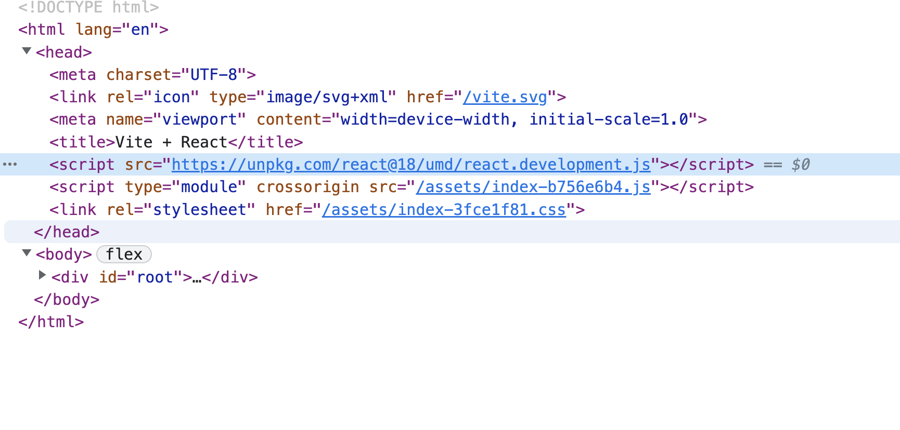
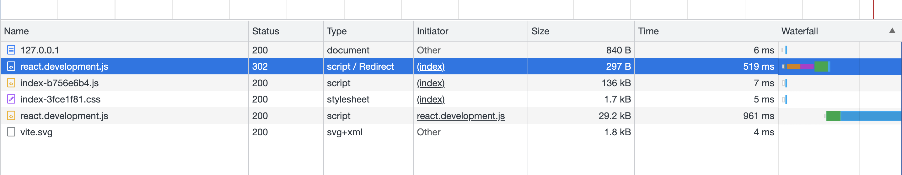
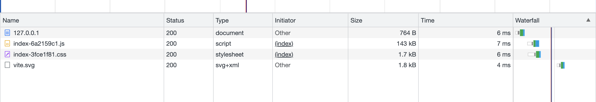

## CDN

原因：用户访问时，就近访问，减少网络延迟。

怎么做：
1. 将静态资源放在 CDN 上，通过 CDN 域名访问，然后在配置 nginx 将静态资源的请求转发到 CDN 上，同时可以设置缓存与缓存过期时间。
2. 如果是固定接口，并且会定时更新，则通过 axios 拦截器，将接口地址替换为 CDN 地址。

## vite 配置

```bash
# install
npm i vite-plugin-cdn-import -D
```

```js
// vite.config.js
import { defineConfig } from 'vite'
// import vitePluginCdnImport from 'vite-plugin-cdn-import'
import {Plugin as vitePluginCdnImport} from 'vite-plugin-cdn-import'

export default defineConfig({
  plugins: [
    vitePluginCdnImport({
      // 指定需要使用 CDN 的依赖，同时会自动注入到 index.html 中。并且不会被打包
      modules: [
        // react
        {
          name: 'react',
          var: 'React',
          path: 'https://unpkg.com/react@18/umd/react.development.js',
        },
        {
          name: 'react-dom',
          var: 'ReactDOM',
          path: 'https://unpkg.com/react-dom@18/umd/react-dom.development.js',
        },

        // vue
        {
          name: 'vue',
          var: 'Vue',
          path: 'https://unpkg.com/vue@next'
        },
        {
          name: 'vue-router',
          var: 'VueRouter',
          path: 'dist/vue-router.global.js'
        },
        {
          name: 'vuex',
          var: 'Vuex',
          path: 'dist/vuex.global.js'
        }
      ],
      prodUrl: 'https://cdn.jsdelivr.net/npm/:name@:version/:path'
    })
  ]
})
```

## webpack 配置 

```bash
# install
npm i cdn-loader -D
```

```js
// webpack.config.js

module.exports = {
  module: {
    rules: [
      {
        test: /\.js$/,
        use: [
          {
            loader: 'cdn-loader',
            options: {
              modules: [
                {
                  name: 'vue',
                  var: 'Vue',
                  path: 'https://unpkg.com/vue@next'
                },
                {
                  name: 'vue-router',
                  var: 'VueRouter',
                  path: 'dist/vue-router.global.js'
                },
                {
                  name: 'vuex',
                  var: 'Vuex',
                  path: 'dist/vuex.global.js'
                }
              ],
              prodUrl: 'https://cdn.jsdelivr.net/npm/:name@:version/:path'
            }
          }
        ]
      }
    ]
  }
}
```

## 使用 cdn 特性的现象

通过 vite 构建，会将依赖打包到 js 中，同时在 index.html 中引入 CDN 资源。

渲染 html：
使用 cdn network 请求：
未使用 cdn network 请求：

