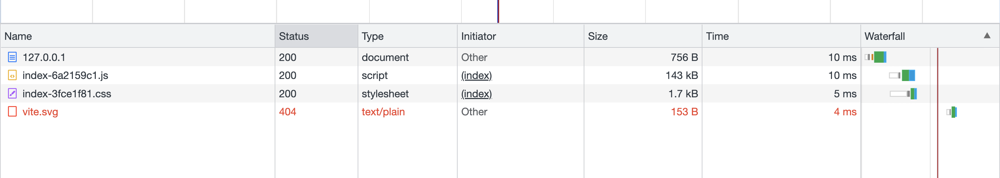
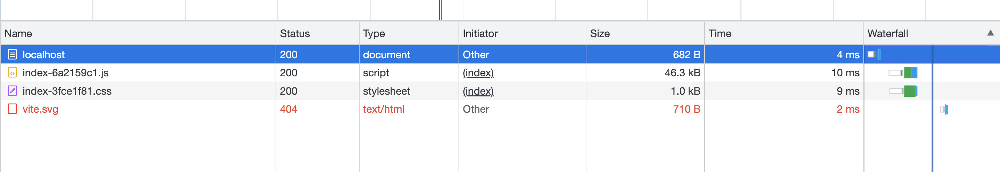

## gzip

原因：能够减小文件体积，传输速度更快。 

怎么做：
1. webpack 通过插件 `compression-webpack-plugin` 进行配置, vite 通过插件 `vite-plugin-compression` 进行配置 
2. nginx 配置，一般是 `location` 段进行 gzip 的开启
3. 客户端 gzip 离线包通过 Service Worker 缓存静态资源，生成离线包，通过 `sw-precache-webpack-plugin` 插件进行配置。另外，离线包的大小需要小于 2M，否则不合适，离线包的加载优先级高于网络请求。

## 配合 webpack 使用

```bash
# install
npm i compression-webpack-plugin -D
```

```js
// webpack.config.js
const CompressionWebpackPlugin = require('compression-webpack-plugin')

module.exports = {
  plugins: [
    new CompressionWebpackPlugin({
      test: /\.js$|\.html$|\.css/, // 匹配文件名
      threshold: 10240, // 对超过 10k 的数据压缩
      deleteOriginalAssets: false // 是否删除源文件
    })
  ]
}
```

## 配合 vite 使用

```bash
# install
npm i vite-plugin-compression -D
```

```js
// vite.config.js
import { defineConfig } from 'vite'
import compression from 'vite-plugin-compression'

export default defineConfig({
  plugins: [
    compression({
      ext: '.gz'
    })
  ]
})
```

## 配合 nginx 使用

```bash
# install
brew install nginx
```

```bash
# config
# /usr/local/etc/nginx/nginx.conf

# config front-end project root path 
location / {
  root /usr/local/var/www;
  index index.html index.htm;
}

# add config in location
gzip on;
gzip_min_length 1k;
gzip_buffers 4 16k;
gzip_comp_level 6;
gzip_types text/plain application/javascript application/x-javascript text/css application/xml text/javascript application/x-httpd-php image/jpeg image/gif image/png;
gzip_vary on;
```

```bash
# start
nginx

# restart
nginx -s reload
```

## 使用 gzip 的大小对比

将项目打包，通过服务器访问，进行比较。

未使用 gzip 压缩的情况下：
使用 gzip 压缩的情况下：

| 文件名 | 未使用 gzip | 使用 gzip |
| --- | --- | --- |
| index.html | 765B | 682B |
| index.js | 143KB | 46.3KB |
| index.css | 1.7KB | 1.0KB |
